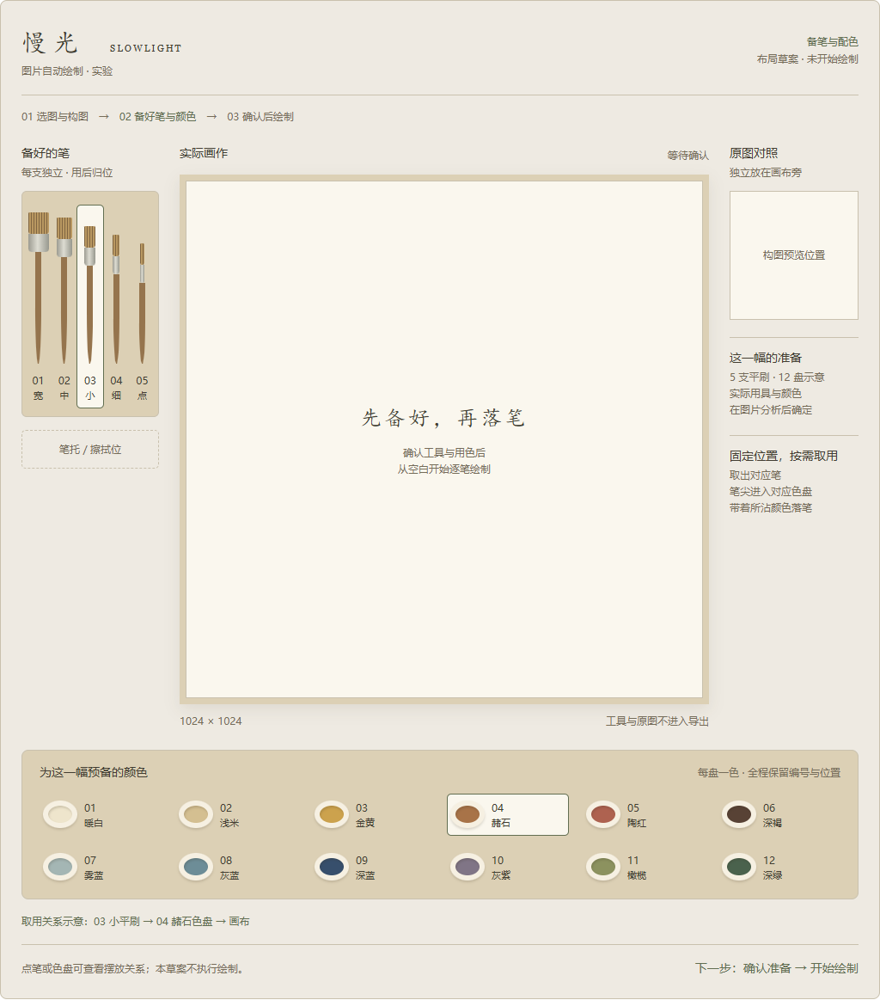

# E1 备笔与配色：布局待确认

后续更新：用户要求主页面以原版为准，认可笔具/色盘方向但要求重排布局。最新待确认稿见 [E1_PREPARATION_LAYOUT_V2.md](E1_PREPARATION_LAYOUT_V2.md)，本文件保留第一稿记录。

本轮仅提交布局草案，等待用户确认后才开始新的绘制过程实现。没有更改当前应用、绘画引擎、规划器或播放器，没有生成新的自动绘画演示。

核对基线：`codex/e1-image-painting` 的 `9914218`；工作区原为干净，已获取远端更新，远端同分支与本地一致。`origin/main` 为 `c5a56a4`。不合并 main，不部署；M1 V4、M2 完整体验与 E1 画作/过程均继续待用户确认。

## 当前问题

现有笔触确实由 Painting 执行，颜色和高度会改变。但当前过程只有一个会随下一笔变色的色盘；笔宽也随计划直接变化。它没有表达“先备好几支具体的笔、配好需要的颜色，再按需取用”。

当前取色记录包含颜色、笔宽与上色量，但没有固定笔具和色盘的身份。给现有动画周围添加装饰笔和色盘不能解决这个问题。

## 提议的空间布局

| 位置 | 内容 | 确认后的行为目标 |
| --- | --- | --- |
| 左侧 | 已准备的独立平刷，按粗细排列，各有编号与固定笔位 | 取出对应的一支，原笔位留下空位提示；换笔先归位，不让同一支笔凭空改变规格 |
| 中央 | 实际作品画布 | 在用户确认准备后才开始落笔；保持原生 1024×1024 与原材质路线 |
| 下方 | 分别装有预备颜色的色盘，各有编号和固定位置 | 笔尖移动至对应盘内完成取色，之后以取得的颜色和上色量绘画；不能把同一个盘临时换色 |
| 右侧 | 原图构图缩略图与准备概览 | 对照独立于作品，不进入导出；不挤占主要绘画区域 |
| 笔架下 | 笔托 / 擦拭位 | 为换笔和换色保留明确的位置；具体擦拭规则在实施时限定，不暗示完整洗笔或颜料化学模拟 |

图中的高亮表示“查看这一支笔/这一盘颜色的位置”，不是正在播放。画布中央文字是准备界面的说明，不属于作品。窄屏将画布、笔架、色盘依次排列；桌面草案可对比左右笔架。没有新增真实画材或三维房间。

## 准备与绘制分开

拟将“确认构图并绘制”拆为以下流程：

1. 选择本地图片并确认构图。
2. 根据该图片准备实际需要的笔具与有限用色，在桌面摆出完整清单；此时只准备，不落笔。
3. 用户检查笔架、色盘、构图后明确开始。返回修改时使旧准备失效，重新准备，不自动开画。
4. 执行确定的取笔、必要的擦拭、取色、移动、落笔、抬笔与归位动作。连续使用同一支笔和相同用色时按实际需要取色，不规定每一笔都机械往返。
5. 暂停、继续、重播和导出沿用实验边界；工具与参考图不进入 PNG。始终与 M2 草稿隔离。

新过程应记录并引用实际的 `brushId`、`dishId` 及固定工具/颜色清单。展示位置与真实取色来源必须对应；暂停与速度只影响调度。准备阶段、抬笔移动和取色动作不能改变作品数组。

## 本次确认的范围与待验证项

**本次希望确认空间摆放，以及“提前准备 → 确认 → 按需取用”的流程。** 草案使用 5 支平刷和 12 盘示意颜色，未针对某张照片完成用色分析；它们不是所有图片的固定配方，也不是已验证的数量上限。草案中的宽度候选为 72 / 36 / 16 / 8 / 4 逻辑像素，不是新引擎参数已落地。

现有规划含大量细微色差和局部笔宽变化。有限色盘与固定笔具需要约束后续规划，不能只在显示层改动。整理颜色可能改变最终成品，不能沿用上一轮“与旧结果逐字节一致”的结论。实现时仍需固定原三张图片、构图与 seed 1906，公开全部结果，检查主要构图、色块关系和细节是否受损；不得为适应有限色盘而换图掩盖差异。

不在本次草案中决定复杂余色混合、颜料耗尽或物理洗笔；不增加风格、教学、模型或付费服务。草案不声称取色与手感已经拟真。上述新机制尚未实现或测试。

## 本轮检查

- 布局渲染与选择反馈：通过。Chrome 无头浏览器，1024 / 736 / 360 CSS 像素、明暗两种外观、左右笔架共 12 组；未发现横向溢出、控件越界或脚本错误。点击笔具与色盘只更新位置示意。
- 截图：实际渲染的布局草案，存入独立的 `artifacts/e1/prepared-layout`；不覆盖任何历史画作、录像、PNG 或验收资料。
- 类型检查、构建、M1/M2/E1 引擎与浏览器回归、性能：未测试。本轮未修改应用、依赖或测试代码；上一轮结果继续以 `E1_BRUSH_PROCESS_REPORT.md` 为准，不作为新机制通过的证据。
- 布局人工确认、固定笔具与有限色盘的成品质量、真实取用过程、触控真机：待用户确认或未测试。

原始布局检查记录：[checks.json](artifacts/e1/prepared-layout/checks.json)。该记录仅针对草案，不是产品验收。没有新增第三方依赖或素材；笔具、色盘示意为本项目原创 CSS，字体沿用系统字体。

本轮停止点：只将本草案与检查资料提交、推送 E1 分支；等待用户确认布局后再开发，不自动播放新的演示、不发布到线上。
