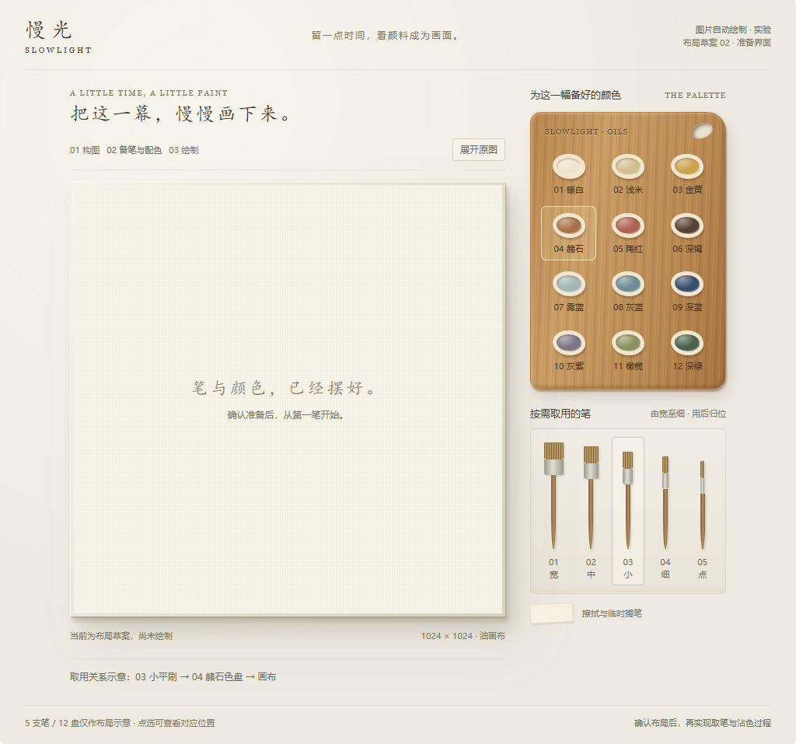

# E1 布局草案 02：原版画室风格，左画布与右侧备料

状态：布局待用户确认，未开始新的自动绘制过程实现。核对基线 `codex/e1-image-painting` / `9e3f416`，开始时工作区干净，远端同分支一致。

## 根据本次反馈确定的边界

- 主页面继续以原版为准。慢光品牌、自由绘画、旅行日落、原画布与调色板的整体效果保持，不将布局草案替换进主画室。
- 图片自动绘制是独立实验页面。保留用户认可的可见笔具与色盘方向，让它们在后续实现中成为真实流程使用的对象。
- 上一稿的工具效果方向获得认可，空间布局与样式仍需调整。用户本次反馈不视为对上一稿布局或新播放机制的验收通过。
- 本轮继续只交布局，不生成新的自动绘画演示；布局确认后再开始实现。继续推送 E1 分支，不合并 main 或部署。

## 调整后的布局

原版采用大画布在左、木质调色板在右的结构；上稿把工具拆到左侧、下方和右侧，导致视觉重心分散、画室整体感不足。本稿将工作区重新组织成左右两部分：

| 区域 | 摆放与样式 | 后续实际使用要求 |
| --- | --- | --- |
| 左侧主区 | 大幅方形画布，保留原版暖色桌面、织纹、薄边厚度、柔和接触阴影；控件集中在画布上方 | 原生 1024×1024 实际作品；准备说明仅为界面，不进入作品 |
| 右侧上方 | 竖向木质备色板，沿用原版木纹、圆角与拇指孔；预备色盘分组排列 | 每盘固定编号、颜色与位置，笔尖必须到对应盘取色 |
| 右侧下方 | 笔架紧接备色板，按宽至细陈列；保留独立笔具形态，减少大面积框选装饰 | 按需拿出、用后归位；取出时原槽显示空位，不让一支笔任意变成另一支 |
| 笔架下缘 | 小块擦拭与临时搁笔位置 | 后续限定换色前处理规则，不承诺颜料耗尽或化学洗笔 |
| 画布上方 | 简短步骤与原图开关；原图展开成可关闭的小幅对照 | 参考层独立，不写入颜色/高度，不进入 PNG；绘画时可收起避免遮挡 |
| 画布下方 | 一条当前用具/颜色反馈 | 后续显示实际执行动作与阶段；准备阶段不自动播放 |

本稿仍使用 5 支笔和 12 盘示意颜色，没有重新分析照片或生成新计划。数量、颜色和固定工具规格仍待验证，不把 12 盘设成任意图片都足够的承诺。草案可点选笔具/色盘、开关原图位置，并可对比每行 3 盘或 4 盘的排布；这些只改变草案的显示。

按“原版为准”的要求，本稿保留固定暖色外观，没有将实验页面单独设计成暗色主题。所有截图是布局草案，不是产品绘画或 PNG 导出证据。

## 建议优先优化的方向

以下是待实施与验证的顺序，不是已经完成的效果，也不扩大本轮的布局范围。

1. **先保证成品的主要颜色与构图。** 预备色盘应从输入图整理出来；合并相近色时保留主要明暗、冷暖和小面积关键色。固定笔具与有限色盘会影响现有计划，必须用原三张照片、相同构图与 seed 1906 对照，不用更多演示动作掩盖成品变粗糙。
2. **把连续工作组织清楚。** 按阶段和局部区域推进，安全地连续使用同一笔具与颜色，减少在画布各处跳跃及无意义往返。先保留交叠笔触的覆盖依赖，再优化移动距离；不能为了动作好看而打乱画作。
3. **让每个动作有原因。** 需要换笔时归位并取另一支，需要换色或补充计划规定的上色量时到对应盘。沾色后笔毛颜色、实际落笔颜色和上色量一致；抬笔、擦拭、取色期间不改作品数组。没有实现颜料耗尽前，不以虚构的耗尽值驱动表演。
4. **改善接触和运动细节。** 沿真实方向移动，控制落笔、提笔、刷毛展开及笔柄倾角；取色有看得清的短停顿。笔柄尽量避开正在形成的细节，且不能靠移动光标掩盖作品延后更新。速度只改变调度，不能改变笔触和最终状态。
5. **让观看更轻松。** 清楚区分“准备 / 绘制 / 已暂停 / 完成”，显示当前实际阶段和简短动作；原图可收起，暂停与继续位置稳定。对外说明是算法执行过程，不能把色块分阶段自动说成专业画师教学。
6. **守住流畅度与作品安全。** 新增可见工具继续与作品、参考层分开；取用位置适配页面尺寸，但笔触坐标不变。暂停、退出、重播、更换图片须继续正确，M2 草稿不受影响。新动作和绘制任务仍需共同测性能，不能只测空场景。

本次不添加风格商城、AI 讲解、通用回放平台或新付费能力；也不新增真实毛笔/水彩等画材。用户认可的是当前油画笔与色盘的表现方向。

## 本轮验证与停止点

- 布局与本地交互：**通过**。Chrome 无头浏览器检查 1024 / 736 / 360 / 320 CSS 像素、两种宿主外观与每行 3 / 4 盘，共 16 组。未发现横向溢出、控件越界或脚本错误；点选反馈、原图开关通过。原始记录见 [checks.json](artifacts/e1/prepared-layout-v2/checks.json)。
- 实际渲染截图：[桌面布局](artifacts/e1/prepared-layout-v2/layout-1024.png)、[展开原图位置](artifacts/e1/prepared-layout-v2/layout-reference-open.png)、[窄屏布局](artifacts/e1/prepared-layout-v2/layout-360.png)。窄屏是模拟视口，不是真机测试。
- 应用与测试代码：未修改。类型检查、构建、绘画回归和性能本轮**未测试**；上一轮的结果继续以 `E1_BRUSH_PROCESS_REPORT.md` 为准，不证明新的备料/取用机制通过。
- 新布局人工评价：**待用户确认**。新取笔/沾色流程与有限色盘质量：**未实现、未测试**。M1 V4、M2 与 E1 人工验收状态不变。

本轮只提交与推送布局资料。确认本稿后，再把备料清单、固定工具/色盘与实际取用过程接到原有引擎上；不在本轮自动开始演示或部署。
